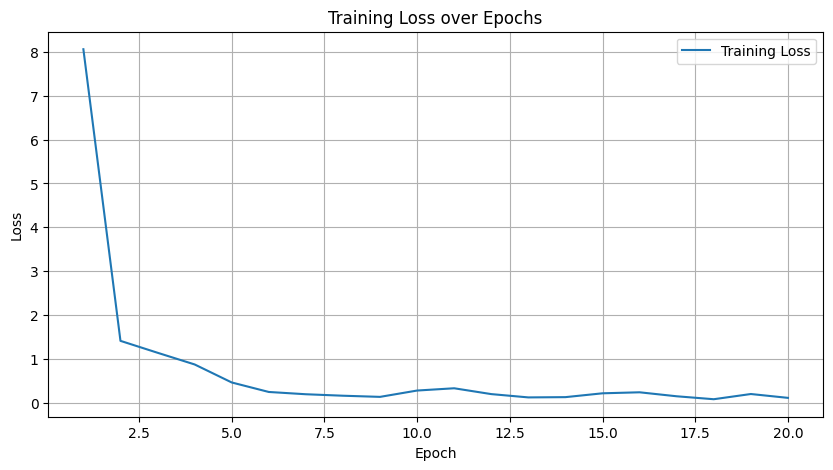
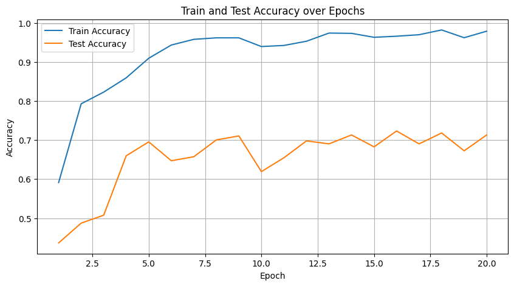

# Brain Tumor Classification Using CNN

## 🎯 Project Objective
Develop a Convolutional Neural Network (CNN) model to classify brain tumors from MRI images into four categories:
- No tumor
- Glioma tumor
- Meningioma tumor
- Pituitary tumor

### Partners
This project was developed as part of a university course focused on deep learning and computer vision. No external partners were involved.

## 🔬 Methods Used
- Data Augmentation (rotation, flipping, shifting, zooming)
- Convolutional Neural Networks (CNN)
- Learning Rate Scheduling
- Early Stopping
- Model Evaluation and Metrics (Accuracy, Loss)
- Model Saving and Tracing (TorchScript, ONNX)

## 🛠️ Technologies
- Python
- PyTorch
- TensorFlow/Keras
- OpenCV
- Seaborn and Matplotlib (visualization)
- Sklearn (data splitting)
- Jetson Nano (target deployment for TensorRT inference)
- TorchScript and ONNX (model export for deployment)

## 📥 Data Download

The dataset used for this project can be downloaded from the following link:

[Brain Tumor MRI Dataset](https://www.kaggle.com/datasets/masoudnickparvar/brain-tumor-mri-dataset)

This dataset contains 7023 MRI images of human brains, categorized into four classes:
- No tumor (1595 images)
- Glioma tumor (1621 images)
- Meningioma tumor (1645 images)
- Pituitary tumor (2162 images)

## 📝 Project Description
This project is designed to classify brain tumor images using CNNs. The dataset is split into training and testing sets, with data 
augmentation applied to improve model generalization. The model undergoes multiple epochs of training and is evaluated using accuracy and 
loss metrics. The best model is saved based on validation accuracy and further exported in formats like TorchScript and ONNX for deployment 
on a Jetson Nano device.

1. **Data Preprocessing**: MRI images are resized and augmented using Keras ImageDataGenerator.
2. **Model Architecture**: A CNN with multiple convolutional, pooling, and batch normalization layers.
3. **Training & Evaluation**: 20 epochs with early stopping and learning rate scheduling.
4. **Model Export**: Best model saved and exported to TorchScript and ONNX formats for edge device deployment.

## 🏆 Results
- Best model saved at epoch: 15
- Best train loss: 0.2412
- Best train accuracy: 96.62%
- Best test accuracy: 72.34%

These results demonstrate the model's strong performance on the training set, with a high accuracy of 96.62% and a low loss of 0.2412. However, the test accuracy of 72.34% suggests some overfitting, as there's a significant gap between training and test performance. This indicates room for improvement in the model's generalization capabilities.

### Analysis
1. **Training Performance**: The low training loss and high accuracy indicate that the model learned the training data well.
2. **Generalization**: The lower test accuracy compared to training accuracy suggests overfitting. This could be addressed by:
   - Increasing dropout rates
   - Applying stronger data augmentation
   - Using regularization techniques like L1/L2 regularization
3. **Model Saving**: The best model was saved at epoch 15, indicating that performance likely plateaued or started to degrade after this point.

### Next Steps
1. Implement techniques to reduce overfitting and improve test accuracy.
2. Fine-tune hyperparameters to bridge the gap between training and test performance.
3. Consider using techniques like cross-validation to get a more robust estimate of model performance.

## 📊 Visualizations

### Training Loss over Epochs

### Train and Test Accuracy over Epochs

## 🚀 Future Work
- Optimize model for Jetson Nano deployment using TensorRT
- Expand dataset for improved model robustness
- Explore alternative deep learning architectures

### To Do
- Further optimize the model for deployment on Jetson Nano using TensorRT.
- Explore other deep learning architectures for improved classification accuracy.
